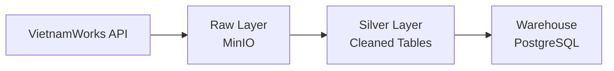

# 🚀 VietnamWorks Data Engineering Pipeline


---

## 📖 Overview

**VietnamWorks Data Engineering Pipeline** là dự án mô phỏng một hệ thống **ETL/ELT production-grade** nhằm thu thập, xử lý và lưu trữ dữ liệu thị trường việc làm từ VietnamWorks API.

Dự án được thiết kế theo tư duy **Modern Data Engineering**, áp dụng:

* **Medallion Architecture**: Raw → Silver → Warehouse
* **Airflow** cho orchestration
* **Python CLI-based ETL** (chạy độc lập, không phụ thuộc Airflow runtime)
Mục tiêu không phải demo, mà là **thiết kế có thể scale và maintain**.

---

## 🏗 Architecture



### Data Flow

1. **Extract** dữ liệu từ API → lưu Raw vào MinIO, kinh phí hơn thì sử dụng AWS, cùng tương thích với S3
2. **Transform Raw → Silver** (clean, normalize, split tables)
3. **Transform Silver → Warehouse** (delta check + upsert)

---

## 🛠 Tech Stack

* **Language**: Python 3.9+
* **Orchestration**: Apache Airflow
* **Database**: PostgreSQL Neon Cloud
* **Object Storage**: MinIO (S3 compatible)
* **Core Libraries**:

  * `pandas`
  * `requests`
  * `psycopg`
  * `minio`
  * `pyyaml`

---

## 📂 Project Structure

```bash
VIETNAMWORK/
├── dags/
│   └── vietnamworks_etl_dag.py     # Airflow DAG (orchestration only)
│
├── etl/
│   ├── extract_to_raw.py           # Extract API → Raw (MinIO)
│   ├── raw_to_silver.py            # Transform Raw → Silver
│   ├── silver_to_warehouse.py      # Transform + Load into Warehouse
│   └── __init__.py
│
├── cleaner/
│   └── df.py                       # Data cleaning utilities
│
├── infra/
│   ├── minio_client.py             # MinIO connection & helpers
│   ├── postgre.py                  # PostgreSQL (psycopg) helpers
│   └── __init__.py
│
├── setup_db/
│   └── create_tables.py            # Init schemas & tables
│
├── transform/
│   └── transform.py                # Shared transform logic
│
├── load/
│   └── load.py                     # Shared load logic
│
├── utilis/
│   └── utilis.py                   # Config loader, common helpers
│
├── config.yaml                     # Environment & credential config
├── requirements.txt
└── README.md
```

### Design Notes

* **DAG chỉ orchestration**, không chứa business logic
* Mỗi file trong `etl/` có thể chạy độc lập qua CLI
* Logic dùng lại được tách sang `infra/`, `transform/`, `load/`, `cleaner/`

---

## ⚙️ Installation & Setup

### 1️⃣ Install dependencies

```bash
pip install -r requirements.txt
```

### 2️⃣ Configuration

Cấu hình trong `config.yaml`:

```yaml
data:
  url: https://ms.vietnamworks.com/job-search/v1.0/search
  body: {"userId":0,"query":"","filter":[],"ranges":[],"order":[],
        "hitsPerPage":100,"page":0,
        "retrieveFields":["address","benefits","jobTitle","salaryMax",
                          "isSalaryVisible","jobLevelVI","isShowLogo",
                          "salaryMin","companyLogo","userId","jobLevel",
                          "jobLevelId","jobId","jobUrl","companyId","approvedOn",
                          "isAnonymous","alias","expiredOn","industries",
                          "industriesV3","workingLocations","services",
                          "companyName","salary","onlineOn","simpleServices",
                          "visibilityDisplay","isShowLogoInSearch","priorityOrder",
                          "skills","profilePublishedSiteMask","jobDescription",
                          "jobRequirement","prettySalary","requiredCoverLetter",
                          "languageSelectedVI","languageSelected","languageSelectedId",
                          "typeWorkingId","createdOn","isAdrLiteJob"],
        "summaryVersion":""
    }

minio:
  endpoint_url: http://localhost:9000
  access_key: 
  secret_key:
  bucket: vietnamwork

posgres:
  connect_str:
  staging:
    schema: staging
    table: job_company
  warehouse:
    schema: warehouse

  dbname: tnd
  user: tnd
  password: tnd
  host: localhost
  port: 5432
```

---

## 🗄 Database Initialization

Khởi tạo schema và bảng:

```bash
python -m setup_db.create_tables
```

Tạo:

* `staging`
* `warehouse`

---

## ▶️ Running the Pipeline

### Airflow (Production way)

Pipeline được orchestrate bằng Airflow DAG:

```
extract → raw_to_silver → silver_to_warehouse
```

### Manual / Local Run (Debug)

```bash
python -m etl.extract_to_raw --rundate 2026-01-01
python -m etl.raw_to_silver --rundate 2026-01-01
python -m etl.silver_to_warehouse --rundate 2026-01-01
```

---

## 📊 Data Model (Warehouse)

### warehouse.company

* `company_id`
* `company_name`
* `company_url`
* `industries`
* `processed_date`

### warehouse.job

* `job_id`
* `job_title`
* `salary_min`
* `salary_max`
* `working_locations`
* `company_id`
* `processed_date`
...
---

## 🎯 Design Principles

* Idempotent theo `rundate`
* Không phụ thuộc Airflow runtime
* Delta-based loading
* Tối ưu cho maintainability hơn là demo nhanh

---

## 📌 Notes

* Không dùng XCom cho data lớn
* Không truyền DataFrame giữa tasks
* Ưu tiên file-based + DB-based handoff

---
